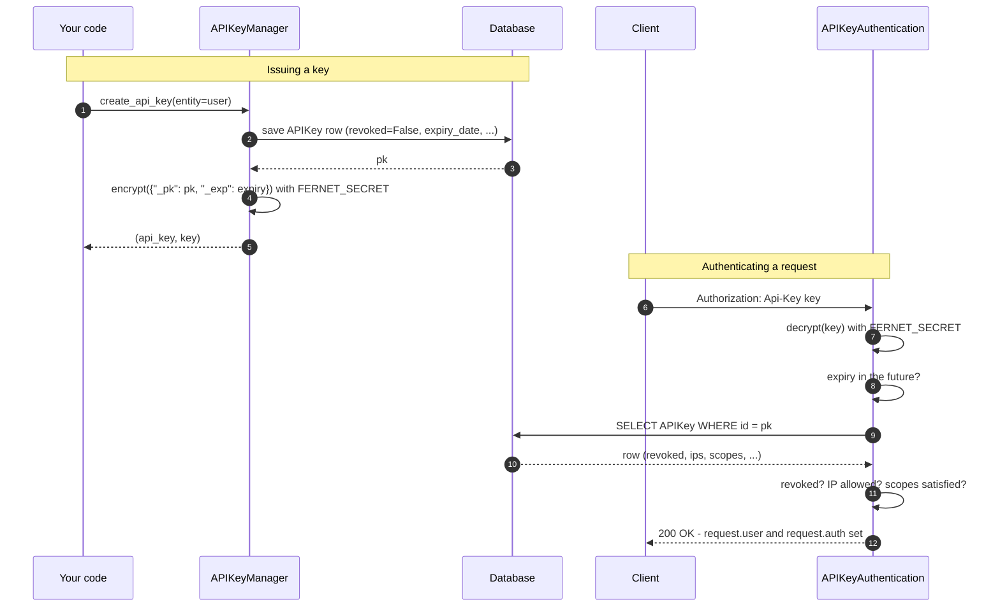
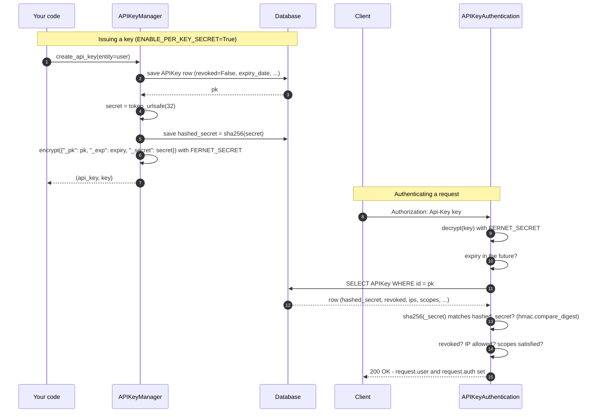

Authentication is used here to identify an entity and make it easy to verify authorization and permissions on each request. By default, we provide an authentication backend that checks for the API Key format and ensures that an entity with this API key exists. Django REST Framework comes with authentication backends that set the `request.user`. With the `APIKeyAuthentication` class, you can find the entity of the Api Key at `request.user` too.

> Working with `request.user` which might not necessarily be an `User` might be a little bit counter-intuitive, but we are looking for solutions to have something such as `request.entity` without having to disrupt the Django REST Framework authentication and authorization flow. If you have some ideas, feel free to open an issue https://github.com/koladev32/drf-simple-apikey/issues.

## How it works

By default, an API key is a [Fernet](https://cryptography.io/en/latest/fernet/)-encrypted token carrying the issuing row's id and expiry — nothing is stored in the database that could be turned back into a valid key, so there's nothing to compare a presented key against except by decrypting it:



The trade-off is that `FERNET_SECRET` alone is enough to decrypt (or forge) that token — see the [Threat Model](/docs/threat-model) for exactly what that means. The opt-in [`ENABLE_PER_KEY_SECRET`](/docs/settings#enable_per_key_secret) setting adds a second, independent secret that only exists as a hash in the database, so a leaked `FERNET_SECRET` on its own is no longer enough:



The only two additions are highlighted by the extra steps around `secret`/`hashed_secret`: everything else is identical to the default flow. Forging a key now requires knowing `FERNET_SECRET` **and** guessing a 256-bit random value — decrypting successfully is no longer sufficient on its own. This only applies to keys created while the setting is on; keys issued before that (or with it left off, the default) have no `hashed_secret` and are authenticated exactly as in the first diagram. See [`ENABLE_PER_KEY_SECRET`](/docs/settings#enable_per_key_secret) for how to turn it on, and the [Threat Model](/docs/threat-model#what-a-leaked-fernet-secret-lets-an-attacker-do) for why plain SHA-256 (not a password hasher) is used to check it.

## Use the `APIKeyAuthentication` backend

In your view, you can add the `APIKeyAuthentication` class to the `authentication_classes` attribute.

```python
class YourViewSet(viewsets.ViewSet):
    http_method_names = ["get"]
    authentication_classes = (APIKeyAuthentication, )
...
```

By default, we check the `authorization` header for a value with a similar format 👉 `Api-Key API_KEY_VALUE`.

The `Api-Key` is by default `AUTHENTICATION_KEYWORD_HEADER` which you can modify in the `settings.py` file of your Django project.

```python
DRF_API_KEY = {
    ...
    "AUTHENTICATION_KEYWORD_HEADER": "YOUR_CUSTOM_VALUE",
}
```

## Combining with other authenticators

`APIKeyAuthentication` follows Django REST Framework's authenticator contract: if the request has no `Authorization` header, or the header uses a different scheme (e.g. `Bearer ...` or `Basic ...`), it returns `None` instead of raising — signaling "not my request to handle" so DRF moves on to the next authenticator in `authentication_classes`. It only raises `AuthenticationFailed` once it's confirmed the request *is* attempting `Api-Key` auth but the value itself is malformed, expired, revoked, or otherwise invalid.

This makes it safe to combine with other authentication classes on the same view:

```python
from rest_framework.authentication import SessionAuthentication

class YourViewSet(viewsets.ViewSet):
    authentication_classes = (APIKeyAuthentication, SessionAuthentication)
    ...
```

A request with a valid session but no `Api-Key` header authenticates via `SessionAuthentication` instead of being rejected outright. Conversely, if none of your authenticators match, `request.user` is `AnonymousUser` — add a permission class (see [Permissions](/docs/permissions)) if anonymous access should be rejected rather than silently allowed.

## Security Features

The authentication backend includes several security features to protect your API:

- **Timing attack protection**: We use constant-time comparisons to prevent attackers from learning about valid API keys by measuring response times.

- **HTTPS enforcement**: By default, we reject API key authentication over unencrypted HTTP connections in production.

- **IP address validation**: When using IP whitelisting or blacklisting, we safely extract and validate IP addresses, even when behind proxies.

For more details about these security features and how they work, see the [Security](/docs/security) documentation.

Feel free to read the code of the authentication class at https://github.com/koladev32/drf-simple-apikey/blob/main/drf-simple-apikey/backends.py.

